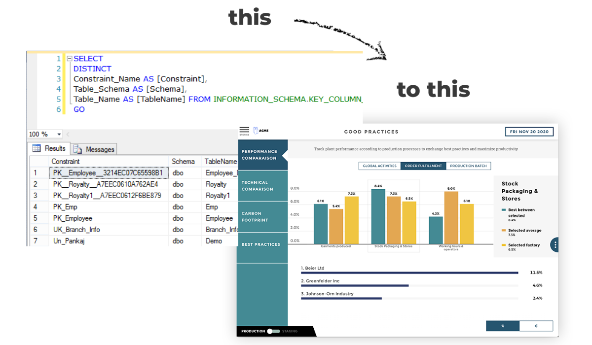

# SQL Data Visualization

A beginner-friendly project that introduces the fundamentals of SQL and demonstrates how to visualize SQL query results using Python and Jupyter Notebooks.

## 📁 Project Structure

```
sqldata_visualization/
├── 01_Introduction.ipynb        # Overview of SQL concepts and setup
├── 02_Data_Visualization.ipynb  # Visualizing SQL data using Python libraries
├── Image/
│   └── sql.png                  # Supporting image used in notebooks
```

## 📚 Contents

1. **01_Introduction.ipynb**  
   Introduces the basics of SQL, including database creation, table operations, and simple queries.

2. **02_Data_Visualization.ipynb**  
   Demonstrates how to:
   - Connect to a database using Python
   - Retrieve SQL data
   - Visualize data using popular libraries like `matplotlib`, `seaborn`, or `pandas`

## 🛠 Requirements

To run the notebooks, make sure you have the following installed:

- Python 3.x
- Jupyter Notebook or JupyterLab
- SQLite3
- pandas
- matplotlib
- seaborn (if used)

Install dependencies with:

```bash
pip install pandas matplotlib seaborn
```

## 💡 Usage

1. Clone this repository:
   ```bash
   git clone https://github.com/yourusername/sqldata_visualization.git
   ```
2. Navigate to the project folder:
   ```bash
   cd sqldata_visualization
   ```
3. Launch Jupyter Notebook:
   ```bash
   jupyter notebook
   ```

4. Open the notebooks and follow along.

## 📷 Preview



## 📄 License

This project is open-source and available under the [MIT License](LICENSE).
